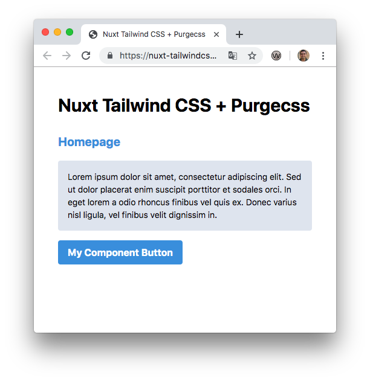

# Nuxt Tailwind CSS + Purgecss

> Demo of using Nuxt with the community [nuxt-tailwindcss](https://github.com/nuxt-community/nuxt-tailwindcss) plugin to drastically reduce CSS size

## Using the plugin

In you next.config.file add the plugin as a 'devModule' and then configure the config and css paths

```js
...
  devModules: ['@nuxtjs/tailwindcss'],
  tailwindcss: {
    configPath: '~/tailwind.js',
    cssPath: '~/assets/css/tailwind.css'
  }
...
```

_The plugin uses [postcss-preset-env](https://preset-env.cssdb.org/) includes and uses autoprefixer without additional configuration!_

## Demo

[https://nuxt-tailwindcss-demo.surge.sh/](https://nuxt-tailwindcss-demo.surge.sh/)



### Before and after stats

The before CSS bundle came out to **`353kb`**, where as using the plugin, it dropped to **`2.73kb`** (granted I'm only using around a dozen classes).

### Performance

And since the CSS remains inline (Nuxt does this by default) it scores perfect on Google Page Speed Insights! (This is after running `nuxt generate` and deploying the `dist` folder)

#### Mobile


#### Desktop


### Other #### Desktop

See also this [demo](https://github.com/nuxt/nuxt.js/tree/dev/examples/with-purgecss)
